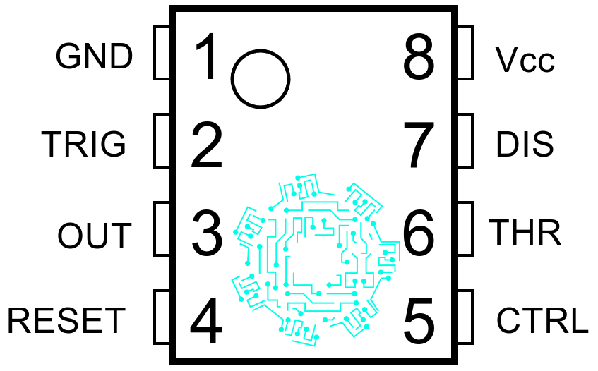
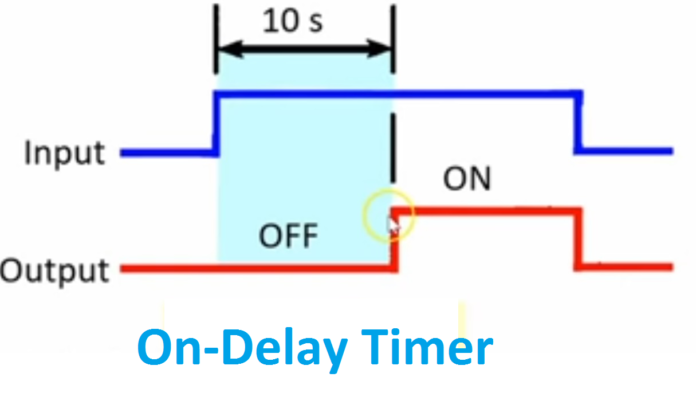

\newpage
# LED AC Rectificador

## Introducción

Mediante tres diferentes arreglos de circuitos, se encenderá un LED mediante una fuente de tipo alterna desde una clavija a la toma de corrientes de 120v. A continuación, se presentará el procedimiento y resultados de la práctica.

## Objetivo

- Encender un LED mediante corriente alterna.

## Marco teórico

### Diodos

El diodo es un dispositivo tipo semiconductor que permite el paso de la corriente eléctrica en un sentido cuando se le administra un voltaje suficiente para dejar que fluya la corriente, e impide su paso a través del otro sentido, el cual usualmente se aplica para rectificar el flujo de la corriente por sus características. Es un componente básico de los circuitos electrónicos que esta muy presente en dispositivos modernos, tales como ordenadores, equipos de audio, televisores, teléfonos, entre otras cosas. De igual manera, su principal aplicación, ya antes mencionado, es como rectificador, ya que permite el cambio de corriente alterna a directa mediante un arreglo conocido como puente de diodos, debido a que cuentan con polaridad, donde estan presentes el cátodo (terminal negativa) y el ánodo (terminal positiva). Los diodos se clasifican según su tipo, tensión y capacidad de corriente.

Imagen de un diodo (pendiente)

Cuando un diodo permite un flujo de corriente, tiene polarización directa. Cuando un diodo tienen polarización inversa, actúa como un aislante y no permite que fluya la corriente.

Imagen del funcionamiento de un diodo.

### Diodo emisor de luz (LED)

Existen varios tipos de diodos con diferentes aplicaciones y utilidades según su configuración y estructura, uno de éstos es el diodo tipo LED, los cuales funcionan en polarización directa, y se caracterizan porque las recombinaciones de los portadores de carga generan fotones, las particulas elementales que forman la luz. Dentro de estos hay de varios tipos, como los DIP (Dual In-Line Package) LED, que son las luces LED tradicionales y en las que piensa la mayoría de la gente cuando se les pide.

### Voltaje 127 AC
Existen múltiples formas de alimentación eléctrica, la más utilizada de manera cotidiana es mediante el voltaje de 127 volts con el que la mayoría contamos en nuestros hogares. Este voltaje se conoce como voltaje nominal y está regulado por el "Reglamento de la Ley del Servicio Público de Energía Eléctrica". Durante esta práctica se utilizará dicho voltaje como forma de alimentación del circuito que se utilizará para analizar el comportamiento de la corriente en dos situaciones.

### Resistencia
Estos componentes están hechos de carbón u otros materiales que se oponen al flujo de corriente, lo cual genera una característica eléctrica llamada "resistencia". Esta característica se define como la oposición al flujo de electrones a través de un conductor.

### Rectificador de media onda
De manera general es un circuito simple empleado para eliminar la mitad de una onda, ya sea la parte positiva o la negativa. Para realizar uno de estos rectificadores basta con colocar un diodo en el circuito. También existen los rectificadores de onda completa cuya construcción es ligeramente más compleja, donde se requieren 4 diodos en un arreglo específico.

## Materiales
A continuación se presenta la lista de los componentes utilizados en ambos casos de la práctica:

|     Componente    | Cantidad |
|:-----------------:|:--------:|
| Cable cal. 22     | 2m       |
| Clavija con cable | 1        |
| LED               | 1        |
| Diodo 1N4007      | 1        |
| Resistencia 30K   | 1        |
## Esquemático

## Resultados y Conclusiones

\newpage

# SCR

## Introducción
Hola

## Objetivo

## Marco teórico

## Materiales

## Esquemático

## Resultados

\newpage
# On Delay 120V

## Introducción

Esta práctica trata sobre la utilización de un LM555 para poder crear un timer on delay con un valor de retardo de 10 segundos para, seguidamente, probar su funcionalidad en un circuito más grande con un foco como información visual.

## Objetivo

- Creación de un timer on delay que pueda funcionar con 120V AC.
- Utilizar el timer on delay previamente creado como un módulo en un circuito combinado con un enclavamiento para mantener encendido un foco.

## Marco teórico

### LM555

El circuito integrado 555 es un temporizador eléctrico y se le conoce como “máquina del tiempo” por la gran variedad de tareas que puede realizar con respecto al tiempo. El LM555 tiene internamente una combinación de circuitos digitales y analógicos, se utiliza comúnmente para proporcionar retardos de tiempo, como oscilador a una determinada frecuencia, y como un circuito integrado flip-flop.

Los empaquetados de los circuitos integrados se pueden identificar por una o varias letras como D, DB, JG, P o PW el cual es el más común para experimentación y tiene 8 pines en total (\cref{conexiones-lm555}).

{width=25%}

1. **GND:** Corresponde a la terminal negativa de la alimentación, generalmente tierra.

2. **Disparo(TRIG):** Es la parte del circuito integrado donde se establece el inicio del tiempo de retardo para la configuración monoestable del LM555. Para que ocurra este proceso el pulso disparador disminuye el voltaje (1/3)Vcc, donde Vcc corresponde al voltaje de alimentación.

3. **Salida(OUT):** En este pin se puede observar el resultado de la configuración del temporizador eléctrico ya sea como monoestable, estable u otra opción.

4. **Reinicio(RESET):** Para un nivel de voltaje por debajo de 0.7 V, tiene la función de poner el pin de salida a nivel bajo. Para evitar el reinicio se deberá conectar este pin a alimentación.

5. **Control de voltaje(CTRL o CONT):** Al utilizar el circuito integrado LM555 como controlador de voltaje, el voltaje en esta terminal puede variar teóricamente desde Vcc hasta aproximadamente 0 V, en la práctica la variación es de Vcc – 1.7 V hasta casi 2 V menos.

6. **Umbral(THR o THRES):** Corresponde a la entrada de un comparador interno de umbral el cual se emplea para poner la señal de salida a un nivel bajo.

7. **Descarga(DIS o DISCH):** Permite descargar el condensador externo al circuito integrado 555 para su funcionamiento.

8. **Voltaje de alimentación(Vcc o Vdd):** Terminal positiva de la alimentación, normalmente son valores de 4.5 V hasta 16 V.

### Timer on delay

Como su nombre lo indica, el timer on delay no genera una salida hasta que transcurre un tiempo predefinido:

{width=50%}

Como se puede observar en la \cref{funcionamiento-on-delay}, cuando se energiza el timer, este no genera una salida alta hasta que pasa, en el caso de este ejemplo, un periodo de tiempo de 10 segundos. Este tiempo es el que puede ser modificado, dependiendo de la aplicación que se le de.

## Materiales

- 1 BC337
- 1 LM555
- 1 contactor
- 1 foco
- 1 relay 12V
- 1 switch nc
- 1 switch no
- Capacitores 103
- Resistencias 10K
- Resistencias 2.2K

## Esquemático

{width=25%}

{width=25%}

{width=25%}

## Resultados

En el inciso a, se logró utilizar el LM555 en su modo monoestable. Esto quiere decir que, combinado con un push button, se logró simular el funcionamiento de un on delay, a pesar de que, en realidad, no lo sea por definición.

En el inciso b, se utiliza el LM555 en el modo de retardo de tiempo, específicamente, después de ser energizado, con un valor de 10 segundos. Esto quiere decir que se logra crear un timer on delay con un valor de retardo a la entrada de 10 segundos. Después de probarlo, se obtienen resultados satisfactorios.

En el inciso c, ya con el timer on delay armado del punto anterior, se utiliza como un módulo para un circuito más grande. Este nuevo circuit cuenta con el timer y un contactor, conectado de manera que se tenga un enclavamiento. Esto logra que, una vez pasado el tiempo de retardo del timer, el foco se activa y, al mismo tiempo, se activa el enclavamiento, manteniendo encendido el foco, siempre y cuando no se desenclave por medio del butón normalmente cerrado.

\newpage
# Enclavamiento Electromagnético

## Introducción

## Objetivo

## Marco teórico

## Materiales

## Esquemático

## Resultados

\newpage
# Arranque, Reversa y Paro con Motor Monofásico

## Introducción

## Objetivo

## Marco teórico

## Materiales

## Esquemático

## Resultados

\newpage
# Chopper

## Introducción

## Objetivo

## Marco teórico

## Materiales

## Esquemático

## Resultados

\newpage
# Arranque, Reversa y Paro con Motor de Lavadora

## Introducción

## Objetivo

## Marco teórico

## Materiales

## Esquemático

## Resultados

\newpage
# Dimmer con Triac

## Introducción

## Objetivo

## Marco teórico

## Materiales

## Esquemático

## Resultados

\newpage
# Dimmer Doble con SCR

## Introducción

## Objetivo

## Marco teórico

## Materiales

## Esquemático

## Resultados

\newpage
# Flyback

## Introducción

## Objetivo

## Marco teórico

## Materiales

## Esquemático

## Resultados

